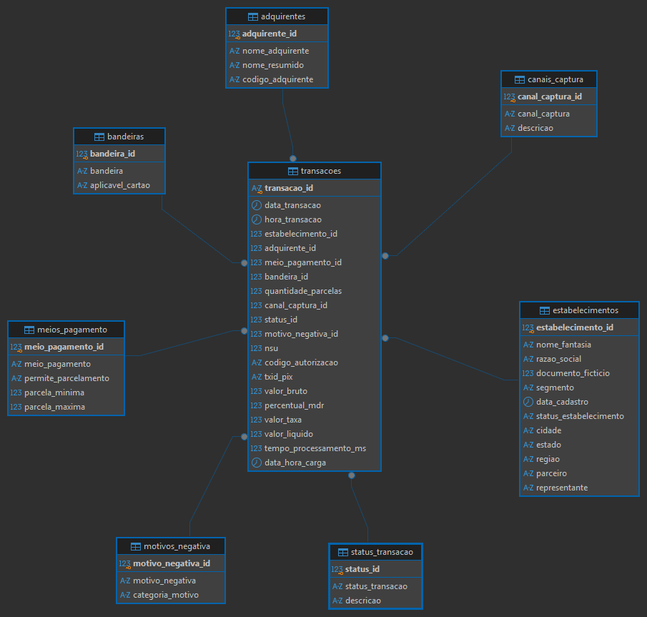
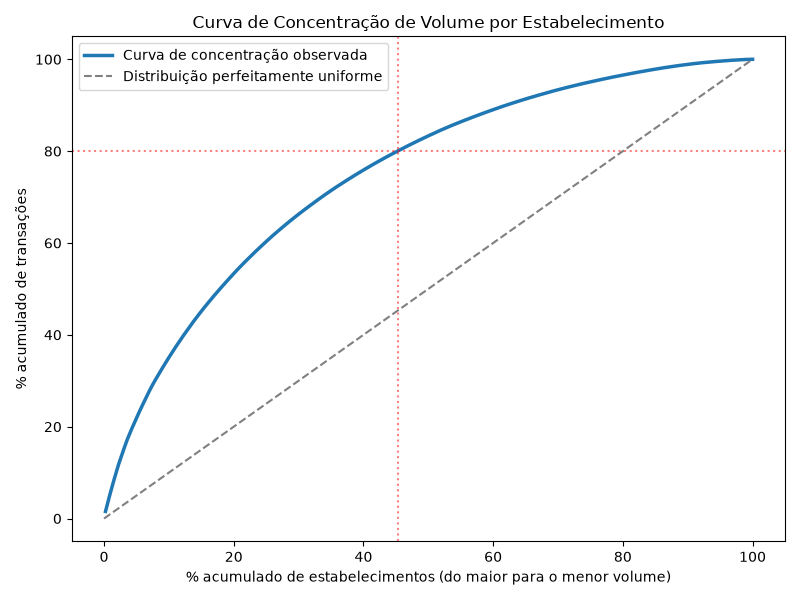
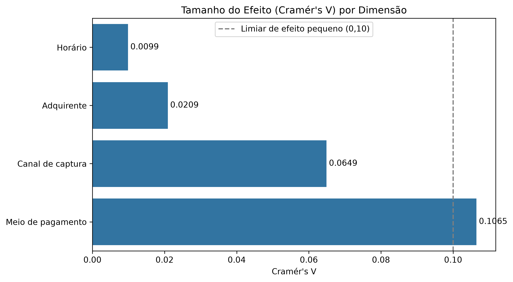
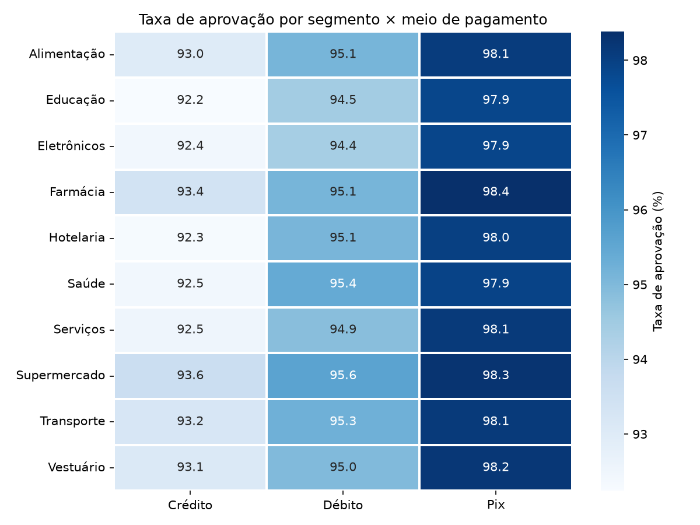
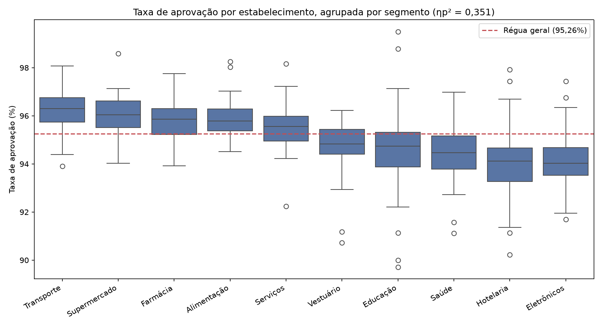
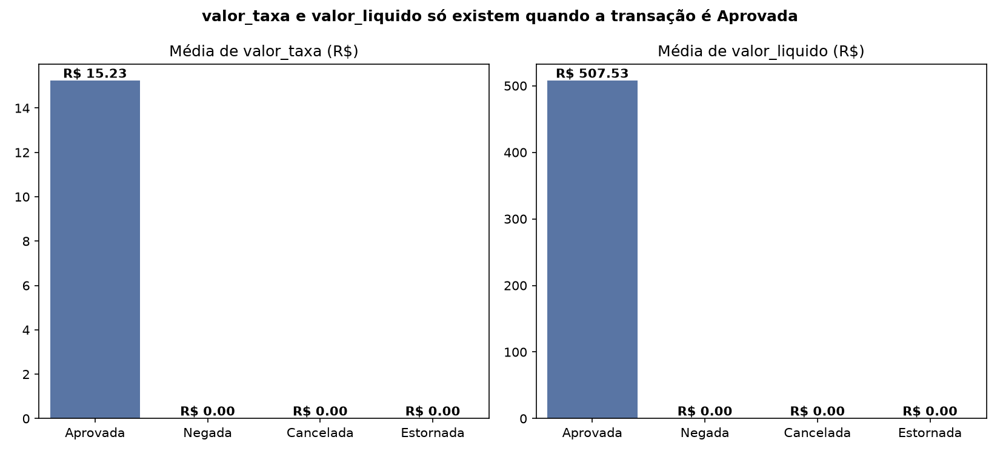

# 📊 Pagamentos Analytics — EDA, Estatística e Data Quality em Dados Transacionais

## Sobre o projeto

Este projeto surgiu como uma evolução do **Pagamentos Analytics**, projeto inicialmente desenvolvido em Power BI para análise de dados transacionais do setor de meios de pagamento.

A proposta desta etapa foi reutilizar uma base que eu já conhecia para aprofundar meus estudos em Ciência de Dados, conectando conhecimentos que já fazem parte da minha atuação com dados (SQL, Python, modelagem, análise e entendimento de negócio) com Estatística, Análise Exploratória de Dados (EDA), Inferência Estatística e preparação para Machine Learning.

Em vez de exercícios estatísticos isolados, optei por construir uma investigação progressiva sobre aproximadamente **583 mil transações**, utilizando PostgreSQL como camada de dados e Python como ambiente principal de análise. O projeto foi dividido em duas etapas de EDA, evoluindo da distribuição dos dados até questões de Data Quality, comportamento temporal, diferenças entre grupos, estabelecimentos fora do padrão e riscos de Data Leakage.

### 🔗 Navegação rápida

- [Notebook 01: Distribuição e Inferência](./Notebook/01_distribuicao_transacoes.ipynb)
- [Notebook 02: EDA Complementar](./Notebook/02_eda_complementar.ipynb)
- [SQL: Estatística Descritiva](./SQL/01_estatistica_descritiva.sql)
- [SQL: Data Quality](./SQL/02_data_quality.sql)
- [SQL: Segmentação por Dimensões](./SQL/03_segmentacao_dimensoes.sql)
- [Imagens e visualizações](./imagens/)
- [Dependências do projeto](./requirements.txt)

---

## 🎯 Objetivo

O objetivo principal é compreender o comportamento da base transacional antes de iniciar qualquer modelagem preditiva. A investigação busca responder:

- Como os valores das transações se distribuem? Tickets elevados são anomalias ou comportamento esperado de certos segmentos?
- Quais dimensões operacionais estão associadas à taxa de aprovação?
- Existem padrões temporais relevantes?
- Alguns estabelecimentos apresentam comportamento muito diferente dos demais?
- Existem problemas de qualidade capazes de distorcer uma futura modelagem?
- Quais variáveis não poderiam ser usadas em um modelo por representarem Data Leakage?

---

## 🔎 Resumo executivo

A EDA foi desenvolvida em duas etapas complementares. A primeira concentrou-se nos fundamentos estatísticos: distribuição, assimetria, outliers, amostragem, intervalo de confiança, correlação, testes de hipótese e tamanho do efeito. A segunda ampliou a investigação para Data Quality, aprovação por dimensões operacionais, comportamento temporal, estabelecimentos e Data Leakage.

Entre os principais aprendizados, o projeto mostrou que significância estatística precisa ser sempre lida junto do tamanho do efeito e do contexto de negócio, e que variáveis aparentemente importantes (como segmento) podem estar carregando o efeito de outra variável mais próxima da causa real (como meio de pagamento).

---

## 💡 Principais conclusões de negócio

**1. A definição da taxa de aprovação precisa ser padronizada**

A regra correta é `aprovadas / (aprovadas + negadas)`. Incluir Canceladas e Estornadas no denominador (eventos que acontecem depois da aprovação, não tentativas de autorização) altera o indicador em aproximadamente 1,2 a 1,3 ponto percentual. Diferença pequena, mas o suficiente pra mudar a leitura de um KPI mesmo com os dados tecnicamente corretos.

**2. Meio de pagamento e canal são as dimensões operacionais de maior relevância prática**

A taxa geral de aprovação (aprovadas/tentativas) ficou em 95,26%. PIX aprova 98,13% contra 93,48% do cartão (Cramér's V=0,1065); POS aprova 95,67% contra 90,66% do Link de Pagamento (V=0,0649). Adquirente e horário são estatisticamente significativos (por causa do volume grande da amostra), mas com efeito prático desprezível.

**3. Existe crescimento no período, mas a origem dos saltos abruptos não pôde ser explicada pelas variáveis disponíveis**

A série temporal apresentou uma tendência de crescimento (r=0,473), porém com saltos concentrados principalmente em fevereiro e junho. A hipótese de que esses movimentos estariam relacionados à entrada de novos parceiros ou estabelecimentos foi investigada e não encontrou suporte nos dados. Como a base possui características sintéticas, esses movimentos devem ser interpretados com cautela e não tratados automaticamente como comportamento real de mercado.

**4. Segmento é um fator estrutural importante, mas parte da associação com aprovação parece ser explicada pelo mix de meio de pagamento**

Segmento explica a maior fatia de variância tanto de quantidade de transações (ηp²=0,111) quanto de taxa de aprovação (ηp²=0,351, confirmado por Kruskal-Wallis) entre estabelecimentos. Ao controlar a comparação pelo meio de pagamento, as diferenças entre segmentos diminuíram consideravelmente. O resultado sugere que parte da associação inicialmente observada entre segmento e aprovação está relacionada ao mix de Crédito, Débito e PIX utilizado por cada segmento (Hotelaria, com 71,6% de cartão de crédito, é o exemplo mais claro). A análise é compatível com uma possível mediação, mas não estabelece causalidade.

**5. Existe um grupo concreto de 39 estabelecimentos com ativação travada**

Dos 500 estabelecimentos cadastrados, 45 seguem sem nenhuma transação mais de 30 dias após o cadastro. Desses, 39 (87%) ainda estão com status Pendente, sem explicação de negócio nos dados disponíveis, o grupo de maior interesse para o time de onboarding. Os outros 6 já têm status (Bloqueado/Inativo) que justifica a ausência de transação.

**6. Seis colunas são Data Leakage e precisam ser excluídas de qualquer modelo preditivo**

`codigo_autorizacao`, `txid_pix`, `motivo_negativa_id`, `valor_taxa`, `valor_liquido` e `tempo_processamento_ms` são geradas como consequência ou durante o próprio processo de decisão de aprovação, e não estariam disponíveis no momento em que um modelo precisaria prever esse resultado. A pergunta usada como critério em toda a checagem: essa informação estaria disponível antes de a transação ser processada?

---

## 🗃️ Arquitetura e stack

A base foi estruturada em **PostgreSQL**, permitindo trabalhar com consultas SQL, relacionamentos e integração direta com Python. O **DBeaver** foi usado para administração e exploração do banco. O diagrama entidade-relacionamento foi gerado automaticamente com **ERAlchemy2 + Graphviz**.



**Banco de dados:** PostgreSQL, SQL, DBeaver
**Python e análise:** Python, Pandas, NumPy, SciPy, Pingouin
**Visualização:** Seaborn, Matplotlib
**Integração:** SQLAlchemy, Psycopg2
**Desenvolvimento:** Jupyter Notebook, VS Code, Git, GitHub
**Modelagem/Diagrama:** ERAlchemy2, Graphviz

---

## 🧭 Etapas do projeto

| Notebook | Foco | Status |
|---|---|---|
| [`01_distribuicao_transacoes.ipynb`](./Notebook/01_distribuicao_transacoes.ipynb) | Distribuição, outliers, amostragem, inferência, correlação e testes entre grupos | ✅ Concluído |
| [`02_eda_complementar.ipynb`](./Notebook/02_eda_complementar.ipynb) | Data Quality, aprovação por dimensões, temporalidade, estabelecimentos e Data Leakage | ✅ Concluído |
| `03_feature_engineering.ipynb` | Features temporais e comportamentais sem leakage | 🔜 Próxima etapa |
| `04_modelagem_aprovacao.ipynb` | Baseline e classificação de aprovação | ⏳ Planejado |

### Notebook 01: Distribuição, Estatística e Inferência

Construiu a base estatística da investigação: estatística descritiva, medidas de tendência central e dispersão, assimetria e curtose, IQR e outliers, amostragem e viés, intervalo de confiança, correlação de Pearson e Spearman, teste t de Welch, ANOVA, teste de Levene, ANOVA de Welch, Games-Howell, Cohen's d e Hedges' g.

**Aprendizado central:** outliers, correlações e diferenças estatisticamente significativas precisam ser interpretados considerando magnitude, contexto e regra de negócio.

### Notebook 02: EDA Complementar

Fechou os blocos de EDA que ainda não tinham sido explorados no Notebook 01:

- **Data Quality:** completude, valores inválidos, consistência entre campos, duplicidade lógica e valores sentinela.
- **Aprovação por dimensão:** meio de pagamento, bandeira, adquirente, canal e horário, usando Cramér's V para medir magnitude prática além do p-valor.
- **Análise temporal:** dia da semana, série diária, média móvel e investigação dos saltos de volume.
- **Estabelecimentos:** concentração da quantidade de transações (Pareto), taxa de aprovação atípica e estabelecimentos sem ativação.
- **Data Leakage:** mapeamento das variáveis que não poderiam ser usadas em um modelo preditivo, direto insumo para a próxima etapa.

---

## ⚠️ Data Quality e limitações

- A base é utilizada para fins de estudo e portfólio e possui características sintéticas, o que explica alguns padrões (como os saltos abruptos de volume) que não puderam ser explicados pelas variáveis disponíveis nos dados.
- Relações encontradas durante a EDA representam associação, não causalidade. Onde um padrão é compatível com mediação (Conclusão 4), isso é sinalizado como tal, não como relação causal comprovada.
- Alguns testes apresentam p-valores muito baixos por causa do volume grande da amostra, por isso tamanho do efeito e contexto de negócio foram usados em conjunto com significância estatística em toda a análise.
- Um subconjunto de 23.149 transações (~4% da base) não tem `codigo_autorizacao` nem `txid_pix` preenchidos. A checagem de duplicidade lógica foi estendida a esse subconjunto com uma chave alternativa e não encontrou evidência de duplicidade nas 583.000 transações.

---

## 📊 Visualizações selecionadas











As demais visualizações geradas nas duas etapas de EDA estão disponíveis na pasta [`imagens/`](./imagens/).

---

## ▶️ Como executar

1. Instale as dependências:

```bash
pip install -r requirements.txt
```

2. Configure o acesso ao PostgreSQL por variáveis de ambiente ou informe a senha quando solicitado pelo notebook.

3. Execute os notebooks na ordem:

```text
Notebook/01_distribuicao_transacoes.ipynb
Notebook/02_eda_complementar.ipynb
```

As células executam as consultas SQL diretamente no PostgreSQL e constroem as análises e visualizações em Python.

> O Graphviz precisa estar instalado no sistema operacional para a geração do diagrama entidade-relacionamento.

---

## 📁 Estrutura do projeto

```text
Projeto_pagamentos-analytics_CD/
│
├── Notebook/
│   ├── 01_distribuicao_transacoes.ipynb
│   └── 02_eda_complementar.ipynb
│
├── SQL/
│   ├── 01_estatistica_descritiva.sql
│   ├── 02_data_quality.sql
│   └── 03_segmentacao_dimensoes.sql
│
├── imagens/
│   └── 21 visualizações geradas pelas duas etapas de EDA
│
├── README.md
└── requirements.txt
```

---

## 🚀 Roadmap

Com a EDA encerrada, a próxima etapa será transformar os padrões identificados em variáveis úteis para um problema de classificação, sempre respeitando a disponibilidade da informação no momento da previsão.

**EDA ✅ → Feature Engineering 🔜 → Baseline → Segundo modelo → Validação e análise de erros**

A principal regra herdada da EDA será a prevenção de Data Leakage: nenhuma variável poderá utilizar informação gerada durante ou após o resultado que o modelo pretende prever.

---

## 🔐 Segurança

As credenciais de acesso ao PostgreSQL não são armazenadas diretamente no código. Os notebooks utilizam variáveis de ambiente ou solicitam a senha durante a execução.

---

## 👤 Autor

**Gabriel Alcazar**

Analista de Dados | Business Intelligence | Python | SQL | Power BI

Projeto desenvolvido como parte da evolução dos estudos em Ciência de Dados, Estatística Aplicada e Machine Learning.
