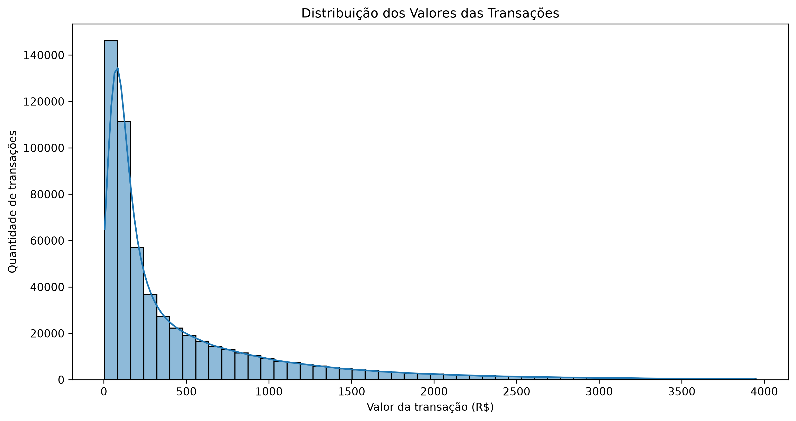
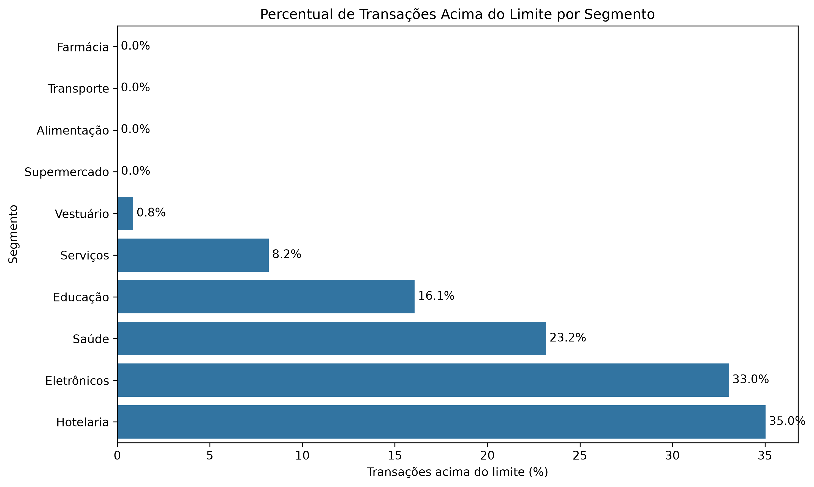
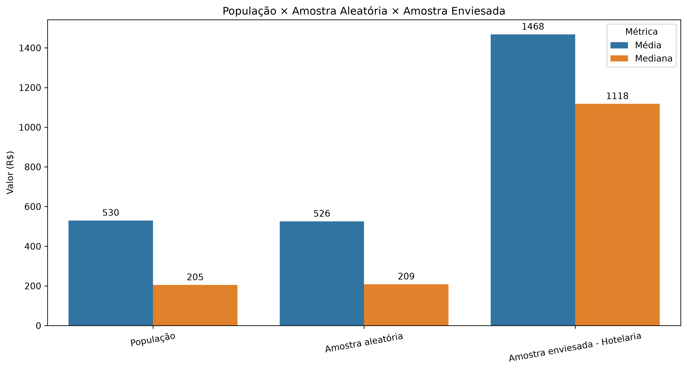
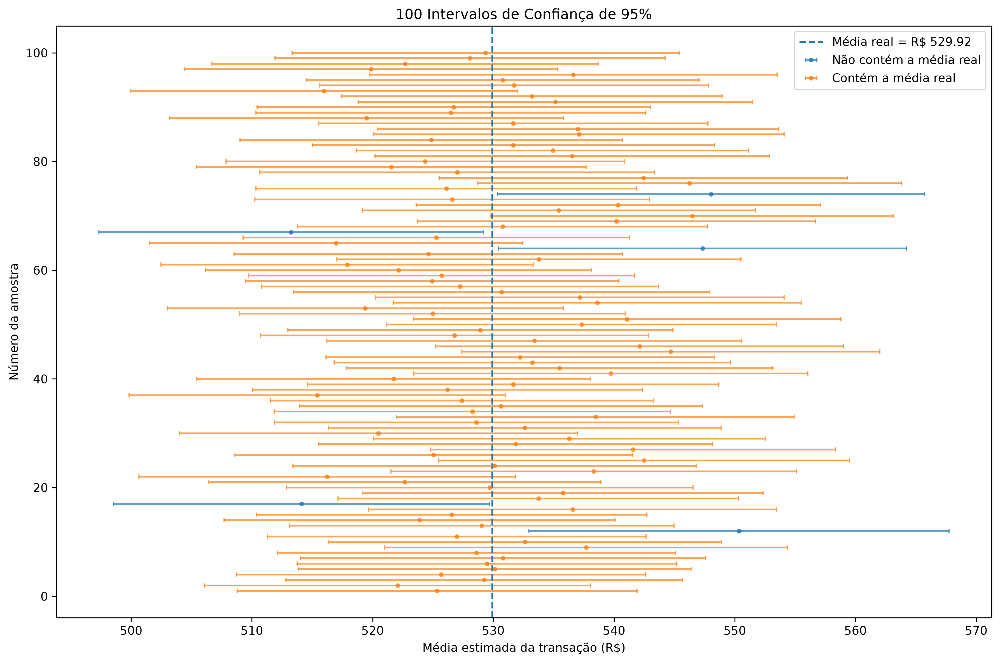
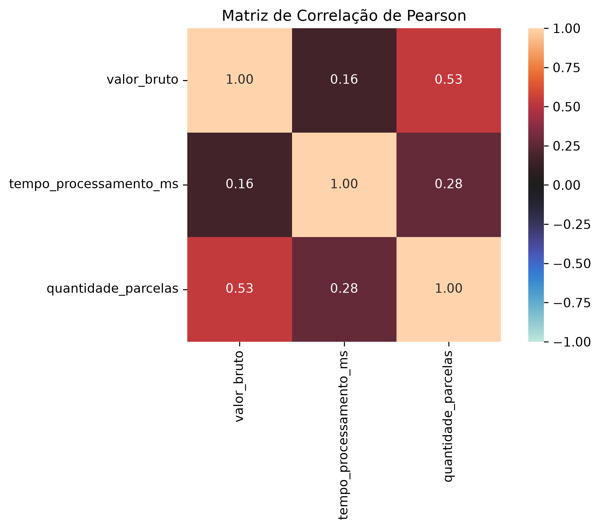
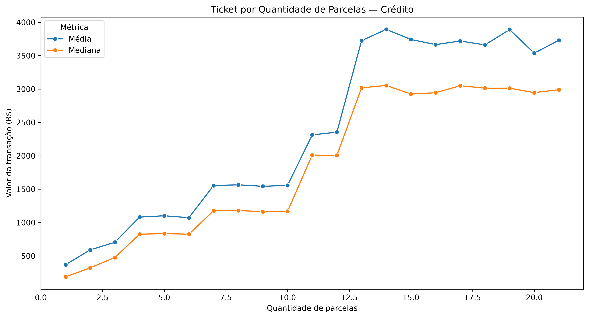
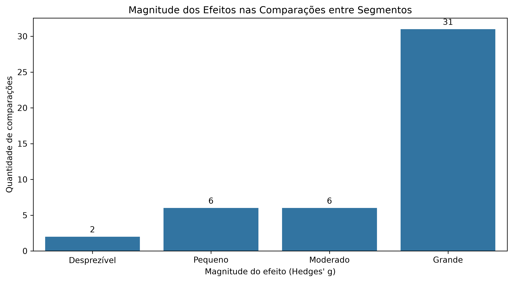

# 📊 Pagamentos Analytics — Estudo Estatístico de Dados Transacionais

## Sobre o projeto

Este projeto surgiu como uma evolução do **Pagamentos Analytics**, projeto inicialmente desenvolvido em Power BI para análise de dados transacionais do setor de meios de pagamento.

A motivação para esta nova etapa foi ampliar minhas **hard skills** e iniciar os estudos em **Ciência de Dados** utilizando uma base que eu já conhecia e que possuía contexto de negócio.

Em vez de começar com exercícios estatísticos isolados, optei por reutilizar a mesma base transacional do projeto de Power BI e transformá-la em um estudo prático de **Estatística, Análise Exploratória de Dados (EDA) e Inferência Estatística**.

A proposta é conectar teoria, SQL, Python, visualização e interpretação de negócio dentro de uma única investigação.

> **Pergunta principal do estudo:**  
> Os tickets elevados são anomalias ou comportamentos esperados de determinados segmentos?

### 🔗 Navegação rápida

- [Notebook da análise](./Notebook/01_distribuicao_transacoes.ipynb)
- [Consultas SQL](./SQL/01_estatistica_descritiva.sql)
- [Imagens e visualizações](./imagens/)
- [Dependências do projeto](./requirements.txt)

---

## 🎯 Objetivos

### Objetivo técnico

Aplicar conceitos fundamentais de Estatística utilizados em Ciência de Dados sobre uma base transacional com aproximadamente **583 mil registros**.

### Objetivo de aprendizado

Utilizar uma única investigação de negócio como fio condutor para compreender, de forma prática e encadeada:

- Estatística descritiva
- Distribuições
- Média e mediana
- Quartis e percentis
- Variância e desvio padrão
- Coeficiente de variação
- IQR e potenciais outliers
- Assimetria e curtose
- Amostragem
- Viés de amostragem
- Erro padrão
- Intervalo de confiança
- Covariância e correlação
- Testes de hipótese
- P-valor
- Tamanho do efeito
- ANOVA
- Teste de Levene
- ANOVA de Welch
- Games-Howell
- Cohen's d
- Hedges' g

---

## 🗃️ Banco de dados

A base originalmente utilizada no Power BI foi estruturada em **PostgreSQL** para permitir que o estudo também envolvesse consultas SQL, modelagem relacional e integração entre banco de dados e Python.

Para administração e exploração do banco foi utilizado o **DBeaver**, escolhido pela facilidade de navegação entre schemas, execução de consultas, inspeção de tabelas e visualização da estrutura do banco.

O diagrama entidade-relacionamento foi gerado automaticamente em Python utilizando **ERAlchemy2 + Graphviz**.


---

## 🛠️ Tecnologias utilizadas

### Banco de dados
- PostgreSQL
- SQL
- DBeaver

### Python e análise de dados
- Python
- Pandas
- NumPy
- SciPy
- Pingouin

### Visualização
- Seaborn
- Matplotlib

### Integração
- SQLAlchemy
- Psycopg2

### Desenvolvimento
- Jupyter Notebook
- VS Code
- Git
- GitHub

### Modelagem
- ERAlchemy2
- Graphviz

---

## ▶️ Como explorar o projeto

1. Instale as dependências:

```bash
pip install -r requirements.txt
```

2. Configure o acesso ao PostgreSQL por variáveis de ambiente ou informe a senha quando solicitado pelo notebook.

3. Abra o notebook principal:

```text
Notebook/01_distribuicao_transacoes.ipynb
```

4. Execute as células em sequência para reproduzir a análise estatística e as visualizações.

> O Graphviz precisa estar instalado no sistema operacional para a geração do diagrama entidade-relacionamento.

---

# 🧭 Etapas do projeto

## 1. Estruturação da base no PostgreSQL

A primeira etapa foi migrar e organizar os dados do projeto de Power BI em um banco relacional PostgreSQL.

Foram criadas tabelas para representar as transações e suas dimensões relacionadas, permitindo trabalhar com relacionamentos, consultas SQL e análises mais próximas de um ambiente real de dados.

Nesta etapa foram trabalhados:

- criação do banco de dados;
- criação das tabelas;
- definição de chaves primárias;
- definição de relacionamentos;
- carga dos dados;
- validação da quantidade de registros;
- exploração inicial pelo DBeaver;
- geração do diagrama entidade-relacionamento.

---

## 2. Estatística descritiva

A análise começou pela variável `valor_bruto`.

Foram estudadas medidas básicas para compreender o comportamento da distribuição:

- média;
- mediana;
- quartis;
- percentis;
- variância;
- desvio padrão;
- coeficiente de variação.

Resultados iniciais:

| Métrica | Resultado |
|---|---:|
| Média | R$ 529,92 |
| Mediana | R$ 205,00 |
| Assimetria | 4,44 |
| Curtose | 36,74 |

A diferença entre média e mediana indicou forte **assimetria à direita**.



---

## 3. Investigação de potenciais outliers

Utilizando o método do **Intervalo Interquartil (IQR)**, foi identificado um limite superior aproximado de:

**R$ 1.476,72**

Aproximadamente **9% das transações** ficaram acima desse limite.

Entretanto, a investigação por segmento mostrou que os maiores tickets estavam concentrados principalmente em segmentos como:

- Hotelaria
- Eletrônicos
- Saúde



### Aprendizado

> Um outlier estatístico não representa necessariamente um erro ou anomalia de negócio.

O contexto do segmento precisa ser considerado antes de qualquer exclusão de observações.

---

## 4. Amostragem e representatividade

Para estudar o conceito de amostragem, foram comparados:

- população completa;
- amostra aleatória de 10.000 registros;
- amostra enviesada para o segmento de Hotelaria.

| Grupo | Média | Mediana |
|---|---:|---:|
| População | R$ 529,92 | R$ 205,00 |
| Amostra aleatória | R$ 536,67 | R$ 208,36 |
| Hotelaria | R$ 1.467,19 | R$ 1.116,06 |

A amostra aleatória reproduziu de maneira razoável o comportamento da população.

Já a amostra restrita ao segmento de Hotelaria apresentou forte viés.



### Aprendizado

> Uma amostra grande não garante representatividade.

A forma como os registros são selecionados é tão importante quanto o tamanho da amostra.

---

## 5. Intervalo de confiança

A partir de uma amostra aleatória de 10.000 transações:

- média amostral: **R$ 536,67**
- erro padrão: **R$ 8,27**
- margem de erro: **± R$ 16,21**
- intervalo de confiança de 95%: **R$ 520,46 até R$ 552,88**

A média real da população, **R$ 529,92**, ficou dentro do intervalo calculado.

Para validar o conceito, o procedimento foi repetido várias vezes.

| Número de simulações | Cobertura observada |
|---:|---:|
| 100 | 95,00% |
| 1.000 | 96,20% |
| 10.000 | 95,39% |



### Aprendizado

O nível de confiança está relacionado ao comportamento do método ao longo de repetidas amostragens e não à probabilidade de um único intervalo específico conter o parâmetro.

---

## 6. Covariância e correlação

Foram analisadas relações entre:

- valor da transação;
- tempo de processamento;
- quantidade de parcelas.

| Relação | Pearson | Spearman |
|---|---:|---:|
| Valor × Tempo de processamento | 0,165 | 0,192 |
| Valor × Quantidade de parcelas | 0,535 | 0,502 |
| Tempo de processamento × Parcelas | 0,278 | 0,353 |

A relação mais relevante foi identificada entre **valor da transação e quantidade de parcelas**.

Mesmo restringindo a análise somente às transações de Crédito, a correlação permaneceu próxima de **0,56**.





### Aprendizado

Os dados sustentam uma percepção comum do negócio:

> Transações de maior valor tendem a apresentar maior quantidade de parcelas.

Entretanto, correlação representa associação e não necessariamente causalidade.

---

## 7. Teste de hipótese

Foi realizada uma comparação entre os tickets médios de **Hotelaria e Eletrônicos**.

### Hipóteses

**H0:** os dois segmentos possuem a mesma média.

**H1:** os segmentos possuem médias diferentes.

O teste t de Welch apresentou:

- estatística t: **4,341**
- p-valor: **0,0000142**

A hipótese nula foi rejeitada.

Existe evidência estatística de diferença entre as médias dos dois segmentos.

---

## 8. Significância estatística × relevância prática

As médias encontradas foram:

| Segmento | Ticket médio |
|---|---:|
| Hotelaria | R$ 1.458,48 |
| Eletrônicos | R$ 1.422,75 |

A diferença absoluta foi de:

**R$ 35,73 — aproximadamente 2,51%**

O tamanho do efeito foi calculado utilizando **Cohen's d**:

**d = 0,0281**

### Aprendizado

Apesar do p-valor extremamente baixo, o tamanho do efeito foi praticamente desprezível.

> Significância estatística não significa necessariamente relevância prática.

Grandes volumes de dados podem tornar diferenças muito pequenas estatisticamente detectáveis.

---

## 9. Comparação entre vários segmentos

Para avaliar simultaneamente todos os segmentos foi aplicada inicialmente uma **ANOVA**.

A análise das variâncias mostrou diferenças consideráveis entre os grupos.

O **teste de Levene** confirmou que as variâncias não eram homogêneas.

Por esse motivo, a análise foi ajustada para utilizar:

- ANOVA de Welch;
- Games-Howell para comparações pós-hoc;
- Hedges' g para tamanho do efeito.

Essa sequência permitiu não apenas identificar se existiam diferenças entre os grupos, mas também medir a magnitude dessas diferenças.



As comparações foram classificadas como:

- desprezível;
- pequena;
- moderada;
- grande.

### Aprendizado

Essa etapa reforçou novamente que uma diferença estatisticamente significativa pode possuir uma magnitude pequena ou até desprezível.

---

# 📌 Principais aprendizados até o momento

O projeto permitiu aplicar conceitos estatísticos dentro de um contexto realista de negócio.

Os principais aprendizados foram:

1. **A média nem sempre representa bem uma distribuição.**
2. **Outlier estatístico não significa automaticamente erro.**
3. **Amostra grande não garante representatividade.**
4. **Intervalos de confiança representam a incerteza de uma estimativa.**
5. **Correlação não significa causalidade.**
6. **P-valor não mede importância prática.**
7. **Tamanho do efeito é essencial para interpretar diferenças.**
8. **As premissas dos testes estatísticos precisam ser verificadas.**
9. **O método estatístico deve ser escolhido de acordo com as características dos dados.**
10. **O contexto de negócio continua sendo essencial para interpretar qualquer resultado estatístico.**

---

# 🚀 Próximos passos

Este projeto representa a primeira etapa dos meus estudos aplicados em Ciência de Dados.

A evolução prevista seguirá uma sequência progressiva.

## Próxima etapa — Fundamentos estatísticos

- Probabilidade aplicada
- Distribuições de probabilidade
- Testes adicionais de hipótese
- Testes para proporções
- Regressão linear como conceito estatístico
- Análise de resíduos
- Multicolinearidade

## Etapa seguinte — Preparação para Machine Learning

- Feature engineering
- Encoding de variáveis categóricas
- Escalonamento e normalização
- Separação entre treino, validação e teste
- Prevenção de data leakage
- Seleção de variáveis

## Modelos supervisionados

### Regressão
- Regressão Linear
- Ridge
- Lasso
- Árvores de Regressão
- Random Forest
- Gradient Boosting

### Classificação
- Regressão Logística
- Decision Tree
- Random Forest
- Gradient Boosting

Possíveis perguntas futuras utilizando a mesma base:

- Quais fatores estão associados à aprovação de uma transação?
- É possível prever a probabilidade de aprovação?
- Quais características estão associadas a tempos de processamento maiores?
- É possível identificar comportamentos transacionais fora do padrão?
- Quais variáveis possuem maior importância para explicar o valor das transações?

## Avaliação de modelos

- MAE
- RMSE
- R²
- Accuracy
- Precision
- Recall
- F1-score
- Matriz de confusão
- ROC-AUC
- Validação cruzada

---

# 📁 Estrutura do projeto

```text
Projeto_pagamentos-analytics_CD/
│
├── Notebook/
│   └── 01_distribuicao_transacoes.ipynb
│
├── SQL/
│   └── 01_estatistica_descritiva.sql
│
├── imagens/
│   ├── amostragem_representatividade.png
│   ├── diagrama_banco.png
│   ├── distribuicao_valor_p99.png
│   ├── intervalos_confianca_100.png
│   ├── magnitude_efeitos_segmentos.png
│   ├── matriz_correlacao_pearson.png
│   ├── ticket_por_parcelas_credito.png
│   ├── ticket_por_segmento.png
│   └── tickets_altos_por_segmento.png
│
├── README.md
└── requirements.txt
```

---

# 🔐 Segurança

As credenciais de acesso ao PostgreSQL não são armazenadas diretamente no código.

Os scripts utilizam variáveis de ambiente ou solicitam a senha durante a execução.

---

# 📚 Contexto

Os dados utilizados neste projeto são destinados a estudo e construção de portfólio.

O objetivo principal é demonstrar a aplicação prática de conceitos de:

- SQL
- PostgreSQL
- Python
- Estatística
- EDA
- Inferência Estatística
- Visualização de Dados

dentro de um problema próximo ao contexto de meios de pagamento.

---

# 👤 Autor

**Gabriel Alcazar da Silva**

Analista de Dados | Business Intelligence | Python | SQL | Power BI

Projeto desenvolvido como parte da evolução dos estudos em **Ciência de Dados e Estatística Aplicada**.
